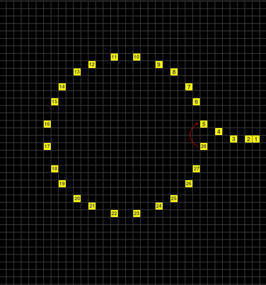

Powyższy rysunek przedstawia hipotetyczną ścieżkę o nieskończonej pętli. Ścieżka kończy się na 28 kroku i po nim następuje skok (bezwarunkowy) do 5 kroku - czerwona strzałeczka to symbolizuje 🙂

Obiekt może poruszać się bardzo podobnym torem, gdzie dolna część ścieżki może być np. węższa o kilka pikseli w efekcie cała ścieżka będzie się lekko przesuwała, aż osiągnie brzeg ekranu i skończy swój bieg "naturalnie".

Dlaczego? Ponieważ dane dt. poruszania się obiektów są względne, tzn. podawana jest wartość przesunięcia `dx` i `dy` (w wartościach od -7…+7 w każdej osi) w każdym kroku. Stąd, przy skoku pomiędzy pkt. 28, a 5 może dojść do innego (niż na rysunku) przesunięcia, np. w lewo i w efekcie cały ruch będzie "spieprzał" w lewo 🙂

Problem pojawia się, gdy tak się nie dzieje.

# Jak wykryć, że ścieżka "wchodzi" w nieskończoną pętlę?

Chodzi o wykrycie tego faktu, aby pętla rysująca, mogła wyjść.

Mam dwie metody, aby osiągnąć powyższe.

## Metoda I

Najprostsze to ograniczenie ilości cykli pętli - w sumie, jest to najszybsze -  ale, nadal nie stwierdza to, czy ścieżka jet zapętlona.

## Metoda II

Jest też pomysł, aby każdy krok był rejestrowany. Położenie x,y i z każdym krokiem, analizować, czy się powtarza, czy nie.

Do tego byłby potrzebne trzy pola (na krok):

- `x`, `y` - położenie bezwględne
- ilość powtórzeń (nazwijmy to `c` od count)

Każdy punkt trzeba przeszukiwać w tablicy, a ilość przeszukiwań rośnie liniowo.
Brak punktu (na liście), tworzy nowy rekord. 
Znalezienie pasującego punktu, zwiększa jego `c` o 1.

Tworzy się mapa powtórzeń punktów.
Można też sprawić, że będą to unikalne punkty, jeżeli co cykl ścieżki, będą eliminowane te rekordy, które mają zero powtórzeń. Jednak, taka eliminacja musiała by się odbywać dopiero po drugim cyklu, gdyż po pierwszym, wszystkie punkty będą miały 0 lub więcej powtórzeń.

Ponieważ po kroku 28 jest skok bezwarunkowy, można założyć, że po osiągnięciu ostatniego kroku:

- jeżeli unikalne punkty będą miały więcej niż 1 powtórzenie to mamy do czynienia z infinity loop.

# Minusy i plusy

Wszystko musi odbywać się w jednej pętli, gdyż nie chce powielać mechanizmów związanych z analizowaniem zdarzeń - nie ma ich wiele, ale poco duplikować kod(?)

Pierwsza metoda już została podsumowana w punkcie ją opisującym.

Druga natomiast to:

## Minusy

- jest czasochłonna
- pamięciożerne, choć to nawet udałoby się zorganizować.

## Plusy

+ Plusem, jest możliwość określenia wstępnych parametrów tablicy, gdyż znana jest ilość kroków ścieżki, a nawet, szybko można określić (już po pierwszym cyklu), ilość kroków ścieżki wchodzącej w skład pętli.